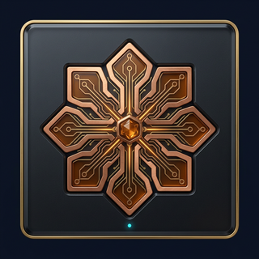
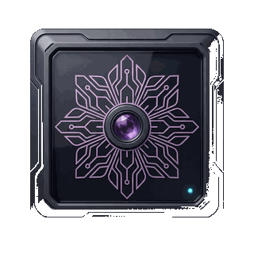

# Seasonal VIP interface assets

Two generated instrument-plate icons in the existing NeuroForge dark-laboratory visual language. They are **cosmetic only**: no MIND mint, token value, mining boost or reward is represented. The original 1024px generations were resized to 320px PNGs (about 260 KB combined) for the shipped UI.

| Copper instrument | Orchid instrument |
| --- | --- |
|  |  |

Used in `frontend/src/pages/profile/SeasonPassPage.tsx` and registered in `frontend/src/lib/visualAssets.ts`. The palette selection is wallet- and season-scoped; it applies only after an active on-chain premium pass is verified and is removed on disconnect, season expiry or unavailable RPC. These assets **do not make the paid pass or MIND spin sale-ready**.
